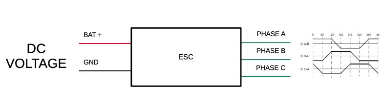
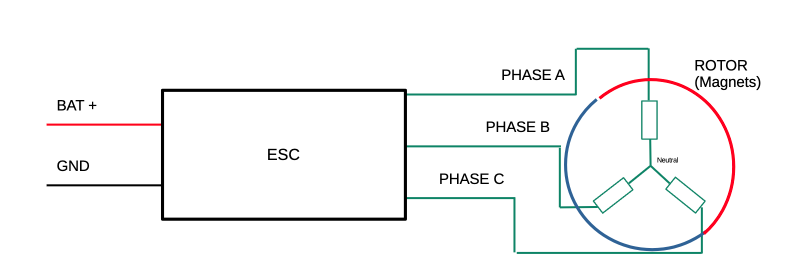
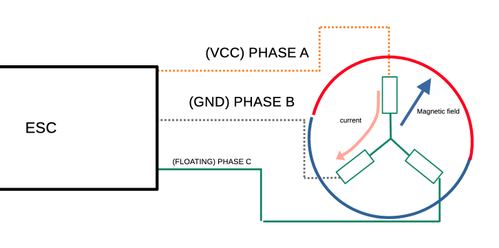
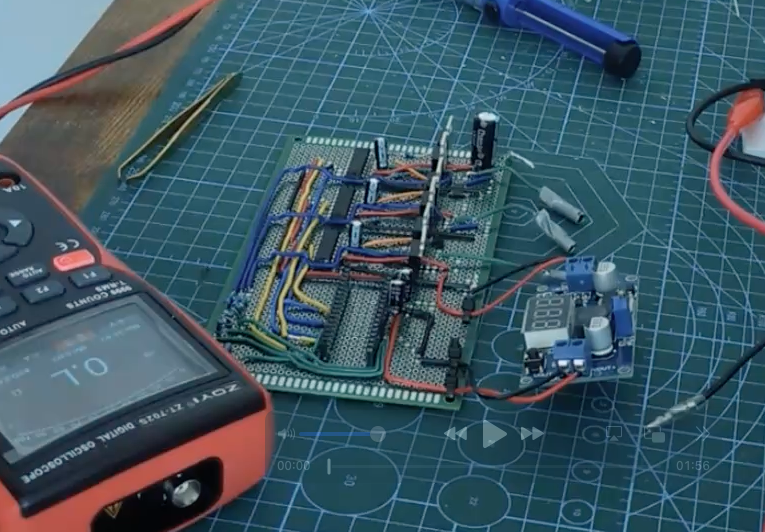
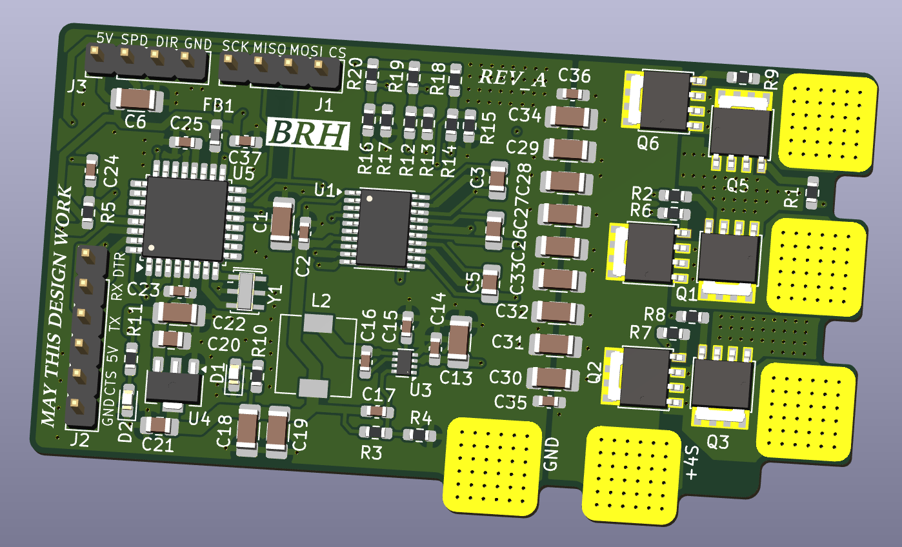
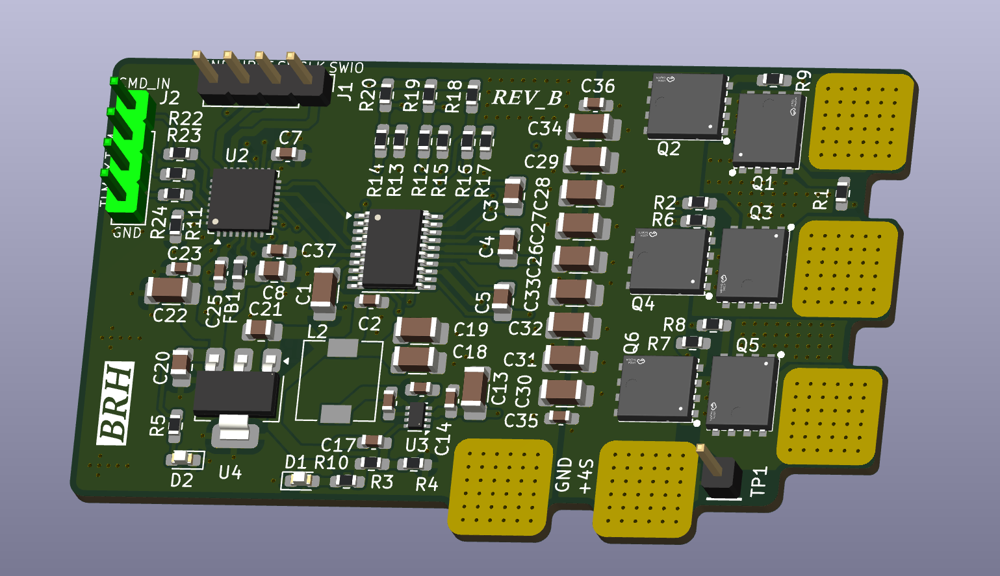
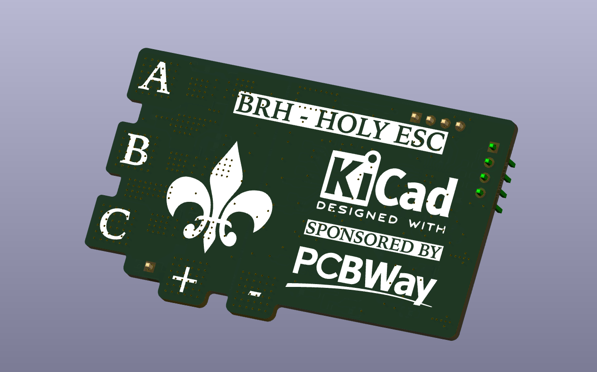

<!-- 2026-06-30-Trademaxxer_handling_collisions_2.md -->

## Introduction & Context

During the past few months, I've been working on my power electronics skills through a project that felt easy on paper, but turned out to be a bit more complicated than expected. This project is the **HOLY ESC**; ESC standing for "Electronic Speed Controller".

The goal of an ESC is simple: grab DC voltage from a battery, and somehow make a 3-phase BLDC motor spin from that DC current. This goal is simple but can be achieved in many ways, each solution involving specific electronics, software and silicon requirements.

In this post, we'll focus on my build: a BEMF (or "Back Electro-Motive Force") control method ESC.

## Principle

Ok, before jumping into the build, let's get the basics out of the way to have a broad understanding of what is going on.

As I said in the intro, the role of the ESC is to make a BrushLess Direct Current motor spin using DC voltage, at a controlled speed. The challenge is not trivial as the motor has 3 phases which can be modeled as 3 large coils, linked together in the middle ("star configuration"), which we can model like so:

Depending on how we make the current flow through the phases, it will create a magnetic field with a given direction. If we place a rotor around these coils, packed with magnets, the rotor will follow the magnetic field.

All we have to do then is make that magnetic field rotate at the speed we want to achieve, and the rotor *should* follow.

<video controls style="width: 100%; max-width: 100%; border-radius: 8px;">
  <source  src="/assets/videos/open_loop_spin.mp4" type="video/mp4">
</video>

{: .prompt-warning }
> Of course, coils are shorts under DC, so we don't set a constant voltage to make the current flow, but a PWM signal. The duty cycle defines the amount of current (or "throttle"). When the rotor is synced, the more current we send, the more torque we can achieve.

This is the principle behind an "open loop" ESC. The main problem is that the rotor is synchronized to the moving magnetic field... until it isn't. Under load, the rotor will easily go out of sync, as we have no way of actually controlling torque.

Long story short, we need a way to know where the rotor is. Since we have **no position sensors**, we'll have to work with what we have.

### BEMF

We don't know where the rotor is exactly, or do we?

We always apply VCC and GND to 2 phases, so we can use the 3rd one, left floating, to detect when the rotor passes right in front of that phase's coils — because the moving rotor induces a voltage in the floating phase.

We can use this Back EMF voltage to schedule the next commutation.

## First Prototypes

At first, I built an open-loop prototype on a perfboard, using an ATmega328p microcontroller:

You can also watch my youtube video to check out the openloop demo build, with a touch of humor:



{: .prompt-info }
> This video will also give more details on the mechanisms like driving MOSFETs and the open loop circuitry.

I also managed to run a couple of closed-loop demos on this perfboard, implementing BEMF reading and scheduling of the next commutation on the ATmega328p!

The issues are:

- Perfboard designs are notoriously bad for such applications as BEMF readings are pretty much garbage
- The ATmega328p is terribly slow, leaving very little room to read the back EMF correctly, leading to very bad performance when conditions are not ideal (high throttle, high RPM, high PWM frequencies, etc.), making the results too unreliable to build further features on without engaging in years of firmware optimizations and overclocking.

At first, I wanted to keep the ATmega328p on the final PCB design for the sake of the challenge:

But after seeing the manufacturing cost for prototypes, I decided to lower my BOM costs and take the opportunity to switch to an STM32 microcontroller, which offers much better performance.

{: .prompt-info }
> Using an STM32 also lets us fall back on established community firmwares if my own firmware struggles under more demanding conditions, making future usage more viable and less time-consuming if something doesn't go as planned.

## PCB design

So I made this PCB in KiCad, which is the Revision B, featuring an STM32 (F051 series) MCU instead of an Atmega328p (as well as cheaper MOSFET as the REVA had 140(/5)$ of mosfets on it...):

As it is my second PCB design, there are surely some mistakes lying around. But it is what it is.

{: .prompt-info }
> This design is heavily inspired by [10x aero's design](https://github.com/10x-Aero/ESC-Development-Board/tree/main) and [AM32 reference designs](https://wiki.am32.ca/development/Hardware-Design.html) you can find online.

{: .prompt-info }
> Also, the fleur-de-lys on the back silkscreen is functional and mandatory as per BRH MEGACORP design standards.

As you can see, this design is focused on closing the BEMF loop to achieve somewhat reliable control.

## Conclusion

In the next post, we'll see if the design worked, and I'll give some feedback on the ESC project as a whole.

Thank you for reading to this point. You can write a comment below if you have any questions.

*Godspeed*

-BRH