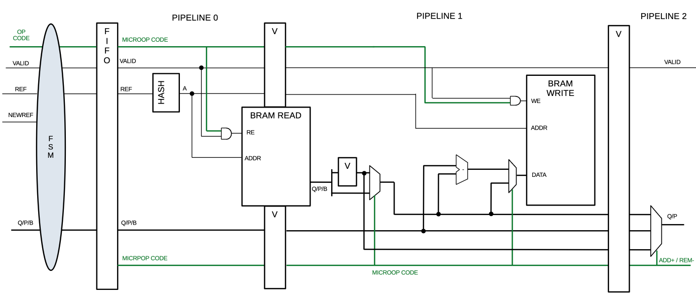
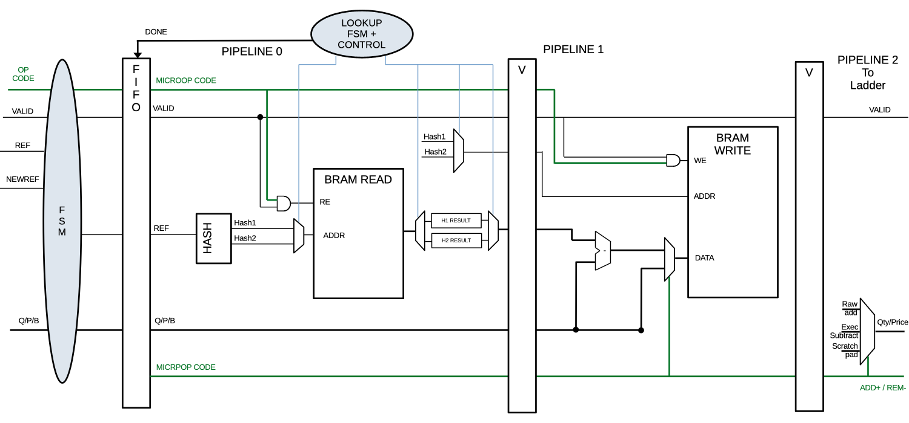
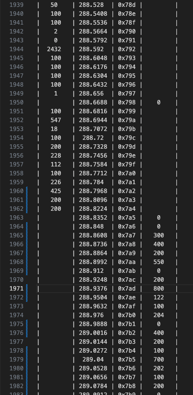
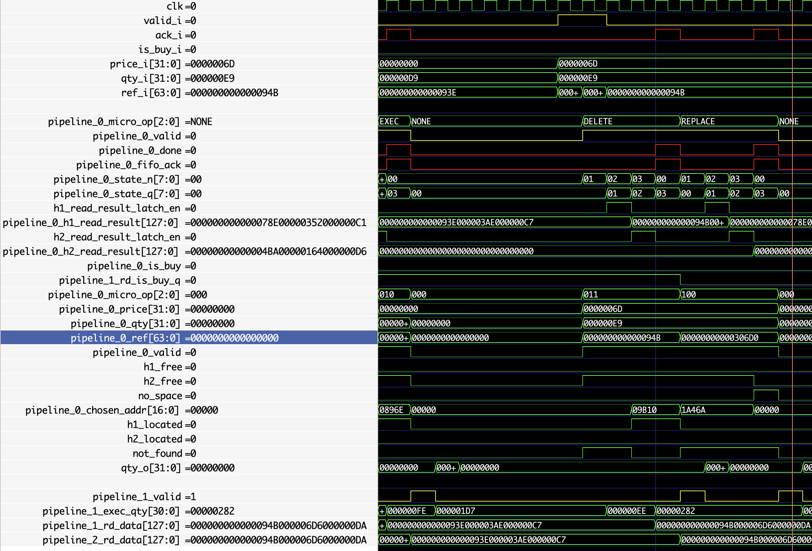
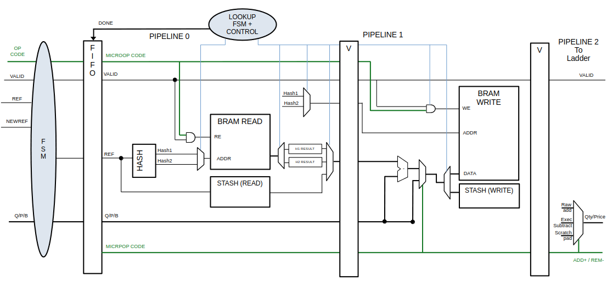

<!-- 2026-06-30-Trademaxxer_handling_collisions_2.md -->

## Introduction & Context

In the previous posts, we designed an entire custom ITCH parser, going all the way from raw ethernet parsing to having a market state.

**The overall functional block diagram:**


We also, in the [part6 post](https://hugobrh.dev/posts/Trademaxxer_handling_collisions/), started to handle the references issues using a hash function, drastically lowering the collision rate.

But it was **NOT** enough ! My objective now is to make a real FPGA demo, with a sort of trading frontend or something like that. But before doing that, we need to spend a little bit more time optimizing our memory management method and make the system a bit more robust.

For an **extremely high stakes** system such as the **TRADEMAXXER**, we need to completely avoid collisions. This objective is theoretically impossible, but practically doable if we play our cards right.

## Adding a FIFO / Buffer

First of all, the trademaxxer was, until now, a 100% parsing system, that only parsed information on the fly without much processing.

Now that we are going to introduce a more advanced pipeline, some stages may need to stall the data stream for X number of clock cycles (variable delay if we want to add cache and DDR access for larger memory availability), **during which ITCH data keeps coming in over ethernet!**

This is why I designed a simple FIFO able to serve as a buffer between the input FSM (responsible for committing micro operations to the pipeline) and the `order_book` pipeline:



This fifo does not need to be deep, even a single register should suffice i theory ! but adding a buffer allows us to have some margins and implement more advanced processing if needed later.

This FIFO also has handshake capability, it latches on the reading output until ans `ack` signal is given.

## Double Hashing

In the previous posts, we used a hash function to better spread references accros our BRAM and lower collision probability.

That was good, but collisions were still a pretty big thing and the usage (or load factor) was pretty low.

To illustrate, see the memory usage simulation example below with a simple multiplication hasha dn real ITCH data from 2019:

- 50_000 AAPL related msgs
- BRAM is $2^{16}$ entries wide

```python
Peak simultaneous live orders   : 22277
Load factor BRAM                : 0.2961
Drops                           : 5492
```

- 30%  BRAM Usage
- 5492 Colisions, resulting in a drop

I'm not gonna pretend to be a nerd who knows how to optimize memory solutions and data structures, because leetcode always pissed me off severely (personally). BUT sometimes we do need to use some computer science principles, and this is one of those times...

Until now, we had many collisions, and no real way to handle them.

A first solution to make that better: we can store the reference alongside order metadata to check whether the hashed address is occupied or not, and if yes, with which reference. This increases BRAM usage a lot, but is mandatory to handle collisions better and ensure some sort of reliability.

That is a good first step; once you know what lives inside a slot you try to write to, you can start probing for a new available space, but this is **super inefficient (around O(logn) or slightly lower AT BEST)**.

IMO, this is not suites for our application. Yes, it theorically allows for better memory usage (load foactor) by searching the free memory slots nearby, but it make the pipeline have an undertermeninstic delay, adds complexity AND I just don't wanna do it, so I won't :).

What we can do instead is use **2 hash functions per reference**. This way, if a slot is not available for a given ref at a given hash, we can use a fixed alternative! Which drastically decreases the chances of a collision occurring.

This method is great for quick fixed duration lookup but is not gonna be 100% efficient (i.e. collisions WILL occur before 100% of our memory space is used), but we'll have more tricks up our sleeves for that later!

Let's re-run the memory simulation, but this time, simulating the usage of 2 hash references for insertion / deletion:

```python
Peak simultaneous live orders : 22277
Total dropped (stash full)    : 1715
Load factor BRAM            : 0.3285
```

- 33%  BRAM Usage
- 1715 Colisions, resulting in a drop

So we do have lower drop counts (more than 3x less collisions), *it's still pretty damn bad*, but it's definitly an improvement !

So let's implement it !

This adds some complexity but it only goes as far as to check and chose what slot to use between the Hash1 and Hash2...

... Which is not nearly as complex as [hardware probing solutions](https://en.wikipedia.org/wiki/Cuckoo_hashing) in my opinion.

So we can now imagine a pipeline that would look more like this:



Now stage 0 gets a some added complexity:

- It generates 2 different fixed hashes per ref.
- Looks up both addresses, one at a time, and checks which is free / or contains the requested ref, depending on op type.
- Chooses a definitive address for the given ref.
- The rest of the pipeline does not change much, it writes to the chosen address and passes the result to the ladder.

After a couple of days of implementing, experimenting & tracking bugs, we get the following ladder result:



{: .prompt-info }
> This ladder comes from a full blown RTL simulation using real ITCH data. Simulation include the whole custom ethernet MAC HDL stack and is dumped via the AXI LITE SLAVE functionnality of the ladder !

These are encouraging results ! depsite the python memory usage simulation our ladder shows low sign of collisions happenning ! Which means I am getting closer to a good looking demo.

## Adding a Stash for Remaining Collisions

Enven though previous results were encouraging, my testbenches focusing on stress testing still reveal collision issues. Here is an illustrated example :



In this testbench, you can see the last `replace` micro operation, which effectively **ADDs** a new reference... **BUT** the `no_space` exception signal gets asserted, showing that despite our double hashing solution, collisions still silently occur.

To prevent that, I added a sort of buffer/scratchpad called the **stash**.

This stash role's is to store orders when all the space is occupied.

To know if that is doable, we can once again use our trusty python memory simulation; and add a stashing mechanism to see how big of a stash we should build (i.e. is this idea good and/or doable on FPGA ?):

```python
Stash occupancy (final)       : 738
Total stash hits              : 1715
Load factor BRAM            : 0.3285
```

We can see that the stash will have to have a depth of around **1024** to be efficient. We chose this number because of the evolution of the number of concurent orders over time:


It hits an obvious ceiling, and so does our stash occupancy ! A depth of **1024** offers us a confortable margin for a demo **AND** is realitic. This stash will be coded to be synthed as FFs and LUTs, not BRAM. $1024 Depth \times 128 Bits$ FFs is very exensive (~125k FFs) but realistic on a KC705. This may just induce pretty bad timing issues, but let's say we keep that for later, or allow us to convert that into BRAM in the future. For now, let's focus on getting something that works !

Now that we know it's doable, I can start implementing the following pipeline in systemVerilog:



And after some debugging, we can now start testing the sytem under some "real" simulation conditions, and perhaps start thinking about FPGA implementation.

## Testing our new system

Before moving on with the FPGA implementation modifications, let's test our raw, unoptimized design logic under real usage conditions using the trademaxxer testbench then I deisgned in a [previous post](https://hugobrh.dev/posts/Trademaxxer_Price_ladder/).

This testbench is pretty advanced ans simulates the whole trademaxxer, including the ethernet MAC logic, by buidling raw ethernet frames, byte by byte, using real binary ITCH data; provided by NASDQ.

{: .prompt-info }
> The unzipped binary is 8GB of pure market events !

I improved the testbench this time to alert us us everytime a collision is detected in logic.

The first reports stated a few hundered, but it turned out it was some bugs and too small stash depth (thus me making the simualtions to know if there was a sweet spot).

After some tinkering, here is the final result of how our system bhaved under real data usage, and using our optimal memory dimension, found using the python memory simulation:

```python
STARTING REPORT ============================= 

Detected collisions :  0
Detected packet gaps :  0

ENDING REPORT =============================== 
```

Great, we can call that a success !

In the next posts, we'll try to **actually** synth this on FPGA, not necessarly run it, but just having a good synt and implementation.

Which **will** be a **big** challenge, given the horrendous resources usage this raw design seems to be having (huge FFs stash + Huge BRAM).

Until then,

*Godspeed*

-BRH