<!-- 2026-07-17-Trademaxxer_FPGA_1.md -->

## Introduction & Context

In the previous posts, we designed an entire custom ITCH parser, going all the way from raw ethernet parsing to having an actually reliable market state.

**The overall functional block diagram:**


We also (in the [part7 post](https://hugobrh.dev/posts/Trademaxxer_handling_collisions_2.md/)) made it so the order book becomes collision free in simulation. (even though it's not perfect, it was a start).

Now that we have a solid HDL base, we can start working our way towards a real FPGA, by implementing the trademaxxer in FPGA fabric !

## First Synth

The first step we have to take, is to make sure our design can synth.

I.e. is Vivado happy about our syntax and is the design using too much resources ?

So I create a new empty vivado project to start testing things out. I will target the KC705 developpement board, which embeds a **XC7K325T** FPGA, which is a pretty *beefy* FPGA. It also has a PCIe connection, which can help later to build a frontend/monitoring application on a host PC. (that will be a subject for another post)


{: .prompt-info }
> Real implemenation in finance will target more advaced boards, with >10G ethernet and HUGE fpgas ([example](https://www.mouser.fr/fr/ProductDetail/ReFLEX-CES/XpressVUP-LP5PT2)).

In vivado, I import my `trademaxxer.sv` top wrapper, which contains all the logic from ethernet parsing to price ladder RTL, and declare it as a top module.

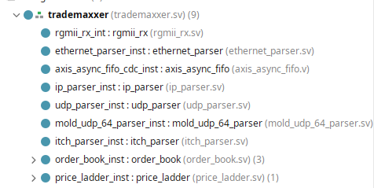

The first raw synthesis gives us the following:

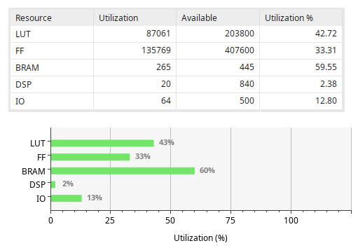

Unsuprisingly, the usage is pretty high, yet the FPGA is pretty big so we can bruteforce our way into having something that fits whithin available fabric.

{: .prompt-info }
> Most of the FFs are used in the stash and most of the BRAM in the order book memory, as expected.

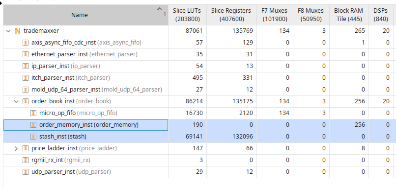

We also see a large amount of DSPs being used, most likely infered by the hash functions (64x64 mul). More on that and the problems it causes in the *BONUS* section at the end of this post.

## First Implementation

For our first implementation tests; our goal is simply to instantiate the trademaxxer module, add constraints, make it run @ 125MHz (*or a bit higher to avoid input ethernet async FIFO overflow, let's say 133.33333MHz*) and add some AXI master (e.g. JTAG AXIM) to monitor the state of the price ladder during the first test runs. Perhaps even add an ILA later once we handle timing and have to face other logic problems.

The 1st implementation took ages (2hours) and came up with shitty results timing-wise:

| **Setup**                    |                     | **Hold**                     |              | **Pulse Width**                          |              |
| :--------------------------- | :-----------------: | :--------------------------- | :----------: | :--------------------------------------- | :----------: |
| Worst Negative Slack (WNS):  |    **-57.045 ns**   | Worst Hold Slack (WHS):      | **0.064 ns** | Worst Pulse Width Slack (WPWS):          | **0.264 ns** |
| Total Negative Slack (TNS):  | **-9858536.534 ns** | Total Hold Slack (THS):      | **0.000 ns** | Total Pulse Width Negative Slack (TPWS): | **0.000 ns** |
| Number of Failing Endpoints: |      **270368**     | Number of Failing Endpoints: |     **0**    | Number of Failing Endpoints:             |     **0**    |
| Total Number of Endpoints:   |      **283335**     | Total Number of Endpoints:   |  **283271**  | Total Number of Endpoints:               |  **138276**  |

{: .prompt-tip }
> bruh.

That was of course expected as our logic is currently extremely **UNOPTIMIZED**. After some investigation, it turns out the critical path is indeed the stash lookup, as we expected in the [part7 post](https://hugobrh.dev/posts/Trademaxxer_handling_collisions_2.md/). The stash is comparing a 64bits reference against 1024 entries, which is brutally bad for timing (*duh*).

## First conclusion and Roadmap for this Post

Okay, so in a nutshell, we have an utilization that goes through the roofs (even though it fits, it's not exactly cheap) and timing that will never pass as-is.

After a lot of trial and error on my side, we have to accept that the *BRAM Fixed Double Hash Table + Stash* combo is just not gonna cut it **alone**, as it is terribly expensive and hard to close timing on with an FPGA.

Meanning we'll need to do quite a lot of shenanigans to fit within FPGA timing & utilization constraints:

- Make the stash actually usable outside of simulation (using reg banks & reduction trees).
- Work on the BRAM "synthesizability"
- Add probing
- Slice the BRAM in 2 entities to double probing performances
- And some other stuff...

{: .prompt-info }
> Of course, everything will be detailled via nice schemes and graphs ;)

That's a lot to cover, so let's dive in !

## Optimizing the Stash to Close Timing

Okay, before re-thinking (again) our whole book architecture, we need to optimize our stash to close timing. Because the base problem (memory collisions) is **NOT AVOIDABLE**, meanning the stash is definitly something we'll still need in the future to handle collisions. So might as well make it usable and robust right now.

Right now, it's just a single register table, async (comb) read, **addressable by its content** (*in that case: a 64bit reference accross 1024 registers*).

No wonder why it does not pass timing lol, a single 64bits comp is already expensive but here, the fanout is just **UNREAL**.

To make this stash a bit better timing wise, we'll need to somehow make it pipelinned and run some logic in parrallel.

{: .prompt-info }
> But how the hell do you we pipeline a register table lookup ?

Well, we divide the big register table into **banks**. We then run the comparators for e**ach bank** "*locally"*, and then add a **reduction tree** to concat the information of each bank, which also shorten the critical path by naturally creating a nice pipeline:

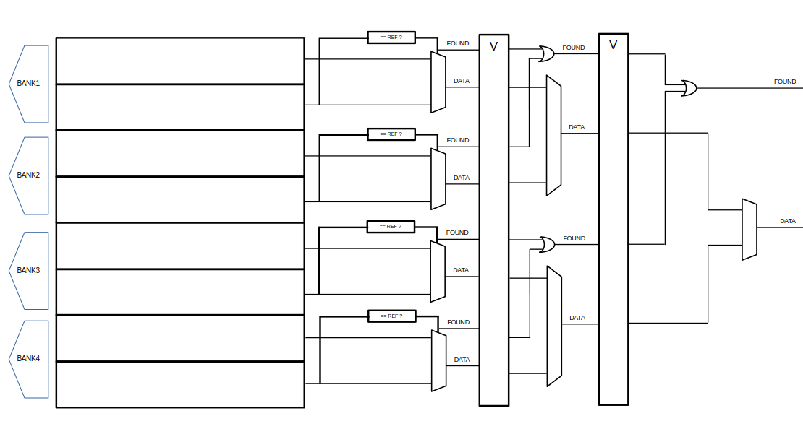

{: .prompt-tip }
> The key here is also to reduce fanout. The lower `REGS_PER_BANK`, the eaiser it will be for vivado to close timming, but it also will increases resource usage and the number of tree stages (more banks for the same amount of regs), thus increasing worst case delay.

As you can see in the figure above, the first reduction tree stage finds out if the request ref is found in its bank, and the reduction tree passes the found data forward, along side the found signal, its position in the bank, etc... until found data is out and ready to read as a clean single output.

The same logic applies to write and delete, as we need to check when we write if the ref is already present (a.k.a shall we update an existing entry for execs and deletes) or is it an entierly new entry, in which case we write to the first available free slot, found using a **pipelined priority encoder** (1 per bank also).

Now, that means the stash now has an important delay, which vary depending on the number of banks, i.e. $D = log_2(B) + 1$ with D the cycles delay and B the number of banks.

These also means we have a state machine for the stash to make the design more robust by accepting incomming requests properly, adding a bit complexity due to handshakes handling. But nothing fancy.

## Re-Thinking our OrderBook Architecture

Even with all our modifications, the critical path is way shorter, yet still very long. In order to make this more bearable, I figured (through trial and error) that we'll need to **lower the stash size to 128 more or less**, lowering utilization and timing concerns.

TLDR, paired with our reduction tree logic, **a 128 depth** for the stash makes the stash pass timing.

Of course, **this does not fit our previous requierements** estimations to avoid data being dropped due to lack of space. We estimated that, for a BRAM address width of `15`, we needed at least 1024 stash entries to cover the collisions on a liquid stock like **AAPL**.

Remember the last posts ? BRAM usage was only around **`33%` at best** using our double hashing method.

This is a pretty poor metric when we think about it, but that's about the best we can achieve without any sort of "*active*" solution. And we **had** to have a **huge stash** to back up the collisions due to this poor BRAM usage.

Now that we know the stash will **need to be smaller**, we need some **active** collision resolution to make the most out of this.

**...**

...I know I said I would **NOT** do it... but we **NEED** to **PROBE**... (*ugh*)

Yes; I know that makes me look bad. But sometimes, you gotta admit when you missed a turn.

{: .prompt-info }
> I'm still very happy about the double hashing method and we'll reuse it. As you'll see later; it will allow for some very nice imprvements to the base probing methods

A very simple yet effective probing method is just... **linear probing**.

If there is a collision detected, we probe the next address and check if that provokes a collision as well, and so on, until we find a space without collisions.

Because in HFT systems, lookup times need to be short and somewhat constant, I'll set a probing limit of **N** before falling back... **to our stash !** (told you it would still be very usefull !).

## Choosing a probing limit **N**

Okay so now that we have a **stash size contraints** (*256 entries MAXIMUM, ideally 128*) we can **simulate memory usage when probing** using a python script and some real ITCH5.0 data on AAPL. The goal is to find a sweet spot where probing is good enough to spare our stash some workload, but also not too large to avoid adding too much delay. Let's find that **sweet spot** !

{: .prompt-info }
> (**Wot an HDL simulation**) This simulation is a python script parsing the ITCH data and using it to feed into a simplified python memory model, reflecting what we'll implement in RTL... "*A simulation of the simulation*" so to speak. This allows us to set up memory requirements and constraints for our deisng by quickly testing what works and what doesn't. I mentionned it in previous posts, which I encourage you to read.

Just a reminder, here is the ABSOLUTE BEST we were able to deliver with just the fixed double hashing method + a big stash in case of collisions:

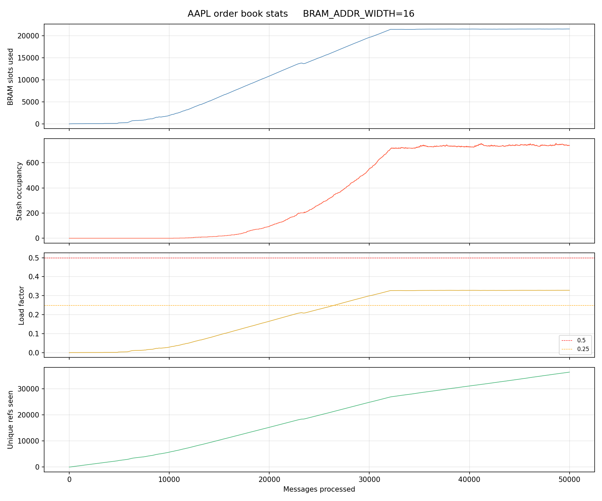

This previous simuilation (discussed in the [previous post](https://hugobrh.dev/posts/Trademaxxer_handling_collisions_2.md/)) showed that APPL hits an activity ceilling, allowing us to set basic constraints, which were :

- We need a 16bits addressed BRAM block
- We need a 1024 deep stash to cover the collision, with margin.

Of course, we showed earlier that this **was not really possible** and that we want a much smaller stash...

...**alegedly** made possible by adding probing to better BRAM usage.

**Let's put that to the test !**

The following figure is a simulation of a SINGLE HASH (no double hash) lookup, followed by `N` probings. I.e. it probes the N adjacent memory spaces to see of some space is available before falling back to stash.

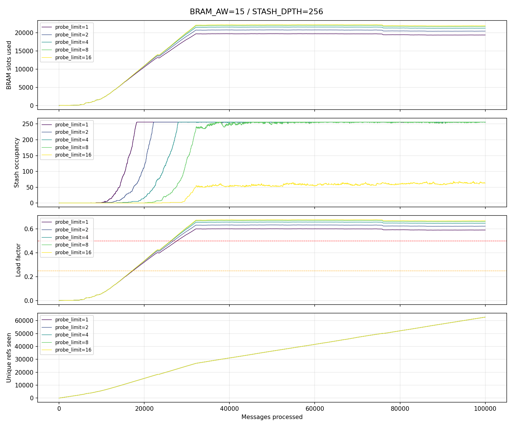

{: .prompt-info }
> And this is using ONLY 1 hashed ref !

We can see that it is much more efficient on the stash for `probe = 16 ` *compared to the fixed double hash* ! Especially since the BRAM is now **15bits addressed** and the stash limit is set to **256 entries MAXIMUM** ! effectively cutting memory usage by 2 and its occupation is way better than a fixed double hash (**66.9%**):

```python
[for probe_limit=16]
Peak simultaneous live orders   : 22302
Total dropped                   : 0
Load factor BRAM                : 0.6691
```

Now, we are going to do the same test, using 2 hashes.

That means we compute 2 hashes each time. If a collision occur, we probe from these 2 hashes at the same time, effectively doubling our probing rate while benefiting from the better double hash initial collision rate !

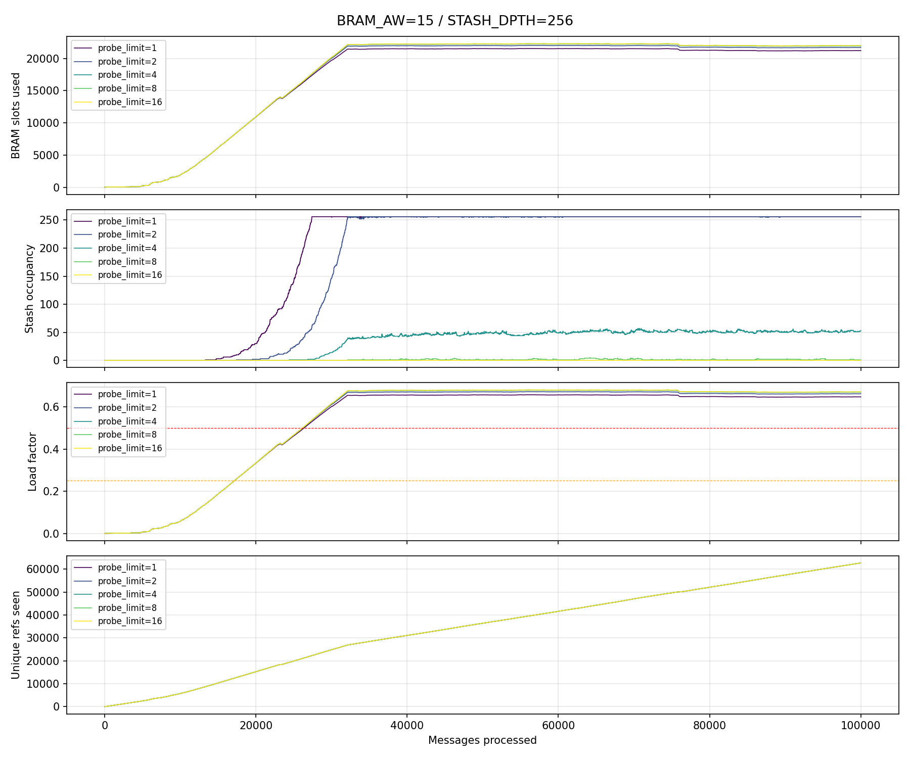

This is way better, in fact, this is the solution we'll go for, as the `probe = 8` offers good results for balanced delays before falling back to stash.

## Implementing the Probing

Implementing the probing is made though the exisitng FSM in the lookup stage (see [previous post](https://hugobrh.dev/posts/Trademaxxer_handling_collisions_2.md/)). We add states to probe the BRAM with our hashed refs up to 8 times to find a suitable memory spot for a given micro operation.

To make this process **more efficient**, given we chose to keep having **2 hashes** to increase efficiency, we can now **divide the main BRAM block into 2 BRAMs** so we can read them in parallel, each hash function mapping to its specific BRAM block.

Meanning having 2 hashed addresses not only increase efficiency, but also **increases probing performances**, as we now probe 2 spots at a time to find a suitable memory spot !

And, as stated before, after 8 failed attempts to find a suitable spot, the FSM falls back into reading from the stash, which also adds delay as we modified it though heavy pipelinning to make the register banks bearable for an FPGA.

After implementing probing, I also ran a simulation (not the memory simulation but the ACTUAL HDL being verified / gardware simulation).

Given the way I made my stash, a "pointer" allows us to kinda see the stash occupation as it increases:

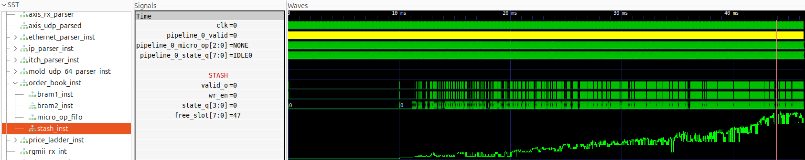

{: .prompt-info }
> This is the RTL sim, it simulates everything, the input are just raw ITCH bytes fed as ethernet frames through a simulated "PHY chip". more details in the post about the testbench : [https://hugobrh.dev/posts/Trademaxxer_ITCH_Parse2/](https://hugobrh.dev/posts/Trademaxxer_ITCH_Parse2/). Note that the timescale is not realistic in this TB as messages are prefiltered (only AAPL) and sent one after another after a fixed arbitrary N cycles delay. Not that the hardware can't filter messages by itself, but it makes reading waveforms waaaaay more practical to prefilter.

## Final New Order Book Diagram

With all of that in mind, here is what our order books looks like (*functional level*), given all the designs adaptations to make it viable to actually run on a KC705 FPGA carrier:

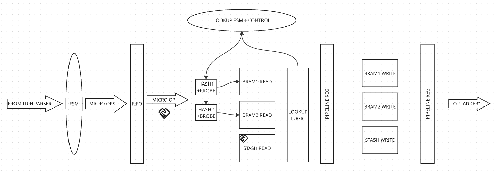

Of course, this is a simplified version, as the deisign is starting to get complex and this scheme is here to summurize the high level features of this processing pipeline.

In a nutshell, we now have:

- An operation input from the itch parser that tells us *what* we need to do, which get boken down into micro operations by the input FSM.
- A FIFO to store incomming micro ops
- A first lookup stage to handle memory and ref lookup to grab data to update
- A memory commit stage, to write the changes to memoey (add, update, delete)
- And finally, a second commit stage that update the "price ladder" using the updated data. This ladder is a condensed view of the market that can be used to deploy basic stategies.

## Tackling Delays

Okay, just a quick note on the delays.

FPGA HFT system **LOVE**:

- Low delay
- Predicatable delay with a low $\sigma$

Meanning we want **low and constant delays**, thus the probing limit and me keeping the stash to handle collisions instead of searching a memory space for ages.

BUT, given today's modifications to the diesgn, we now have worst case delays that look like this:

$$\tau = \tau_{FIFO} + \tau_{pipeline} + \tau_{worst\space case\space lookup}$$

With:

$$\tau_{worst\space case\space lookup} = \tau_{probing} + \tau_{stash} + \tau_{handshakes}$$

let's assume:

- $\tau_{handshakes} = 2 \times T_{cycle} = 2\times\frac{1}{f = 133.333MHz} = 15ns$ 
- $\tau_{probing} = 8 \times T_{cycle} = 60ns$ 
- $\tau_{stash} = log_2(16\space Banks) \times T_{cycle} = 30ns$ 

Meanning an approx $110ns$ to $130ns$ delay **WORST CASE** to go through **THE ENTIRE PIPELINE**.

{: .prompt-info }
> overall ballpark, not empirically verified yet and not including the PHY chip on the KC705 PCB , we may also wanna add 4 cycles, i.e. an extra $30ns$ for the input ethernet to ITCH stack parser, which feed data directly from PHY to the pipeline.

Thats' not a super great delay tbh, even **RUST** (*ugh*) "devs" do better on their shitty CPU (*ugh*)...

**...BUUUT...**

**...Most of the time,** it will not even **probe** (collisons remain scarce events !)

And if it does, it's only for 1 or 2 cycles. Meanning the delays will most likely reamin between $25ns$ to $50ns$ , **accross the whole pipeline**.

With a low collison rate (of less than 2%, even under high occupancy), and a stash hit rate that becomes **ridiculusly LOW** thanks to probing, the **average delay** has to be pretty low for this pipeline, especially for a **small 1G ethernet DEMO on a KC705** !

**AND** I do have ideas to optimize the stash delay / hit it less often. Wonderful innit ?

{: .prompt-info }
> Getting a real average delay is a todo for later. This is just a ballpark to take with a fistful of salt.

Finally, one may be concerned that incomming requests may get dropped because now the pipeline may be busy processing a micro-op as a new ITCH mesage is being recieved via AXI STREAM (which doen't implement a handshake in my design).

**BUT** in the previous post, we developped an input FIFO exactly for that matter, if a micro op take too much time to be processed, the input FIFO handles backpressure in extreme cases. 

## BONUS for FPGA Nerds: Timing Issues & New Hashing !

After all that, I was pretty close to finally have a working implementation, but I still needed to tackle some remainning timing issues.

I wanna take you on a ride on how I usually solve that.

Here is an obvious one: the hashes.

These take a LOT of time as I decided to implement them as a 64bits `MUL`. Usally that's not a problem as Vivado infers DSPs to handle these workloads, which are pretty fast. But here, even DSP struggle to keep up in the first pipeline stage:

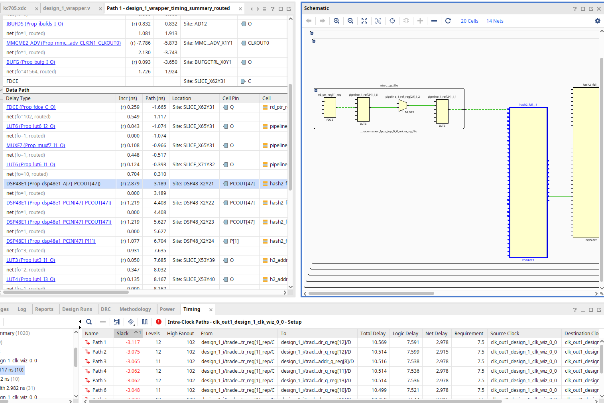

In this vivado report, you can see that my critical path is 3ns late, starting from my FIFO on the left and going into DSPs to compute the hashes, and then into some logic to consume said hashes.

Looking into the report, we can see that it includes my hashing DSPs, and that the 3 DSPs back to back (to complete the 64 bits operation) take more than 5ns !

To solve this issue, a simple registers right after the DSPs would **not** work, beacause *I ALREADY HAVE ONE*:

```verilog
// Addr conv (mulled fold hash)
localparam logic [63:0] HASH_CONST_1 = 64'h9E3779B97F4A7C15;
localparam logic [63:0] HASH_CONST_2 = 64'h6C62272E07BB0142;
logic [BRAM_ADDR_WIDTH-1:0] h1_addr, h2_addr;
logic [BRAM_ADDR_WIDTH-1:0] h1_addr_q, h2_addr_q;
logic [63:0] hash1_full, hash2_full;

assign hash1_full = pipeline_0_ref * HASH_CONST_1;
assign hash2_full = pipeline_0_ref * HASH_CONST_2;

assign h1_addr = hash1_full[63-:BRAM_ADDR_WIDTH];
assign h2_addr = hash2_full[63-:BRAM_ADDR_WIDTH];

// this latch is here to break critical path
always_ff @(posedge clk) begin
    h1_addr_q <= h1_addr;
    h2_addr_q <= h2_addr;
end
```

So the hashing is too harsh and does not meet timing...

We can use smaller hash constants, but the thing is we can lose entropy... Let's test it out using the same simulation and the probing simulation, except we replace the 64 bits hashing keys by:

```python
HASH_CONST_1 = 0x9E3779B9 # 32-bit golden ratio constant
HASH_CONST_2 = 0x85EBCA6B # murmur3 finalizer constant
```

And we get the following results (with an additionnal XOR fold on the ref to match the 32 bits width):

What id we XOR fold the ref onto itself before hasing it ? basically merging the two hashing methods we used in previous posts:

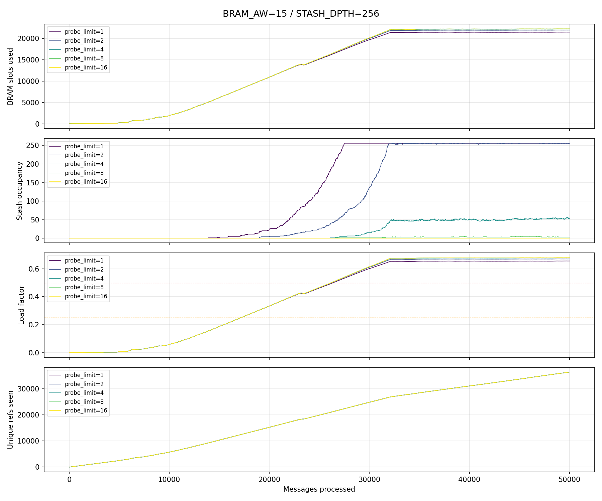

and we get the following stats:

```python
Peak simultaneous live orders   : 22277
Total dropped                   : 0
Load factor BRAM                : 0.6796
```

## Final Implementation & Conclusion.

Currently going through a sh*tload of *FPGA/VIVADO* related shenanigans that are not described here, I ill update this post one the TIMING passes. For now, it doesnt, some 1ns paths remains. I hope to finish that tommorow.

## Conclusion

This post is getting pretty dense, so I'll cover the rest (FPGA tests) in a next post.

I wanted to go a bit deeper into the details, and there was a lot of changes to cover !

I think the next posts are going to be back to a little higher level view alongside a youtube video ;)

In any case, hope you got some interresting insights from my hobby work ! I know it's giga nerdy, but I like to spend my free time like this, it stimulates my brain a little bit during a few hours. I don't know when I'll stop doing it, perhaps soon when I'll start to try and start projects in "*the real life"*.

But... you know... it's hard to figure these things out sometimes...

Thank you for reading to this point. You can write a comment below OR send me an email if you have any question : [https://hugobrh.dev/contact/](https://hugobrh.dev/contact/).

*Godspeed*

-BRH