## Useful Links

- [Github Repo](https://github.com/0BAB1/HOLY_ESC)
- [PCBWAY Community Direct order link](https://www.pcbway.com/project/shareproject/BRH_HOLY_ESC_c15b2b6a.html)
- [Youtube Video](https://www.youtube.com/watch?v=6r7aRO6pUqM)

## Introduction & Context

During the past few months, I've been working on my power electronics skills through a project that felt easy on paper, but turned out to be a bit more complicated than expected. This project is the **HOLY ESC**; ESC standing for "Electronic Speed Controller".

The **goal** of an ESC is simple: grab DC voltage from a battery, and somehow **make a 3-phase BLDC motor spin** from that DC current. This goal is simple but can be achieved in many ways, each solution involving specific electronics, software and silicon requirements. My solution explores the **BEMF method** to control the **BLDC motor**, final application being for a **fully custom drone.**

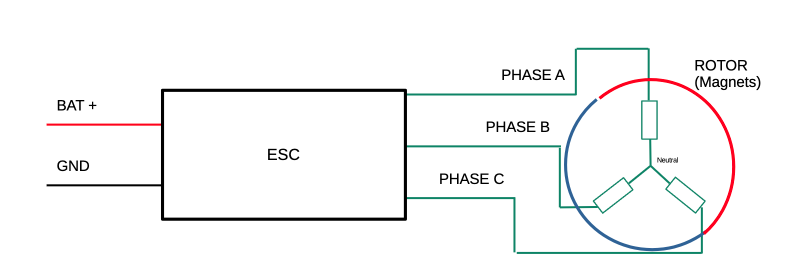

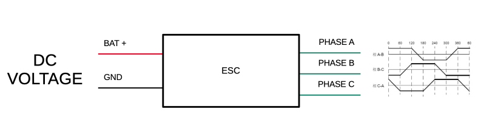

Note I already have a 1st post on the subject : [1st ESC post](https://hugobrh.dev/posts/ESC_PCB_design_review/)

## What's New ?

Okay so in the last post we left on the fact that the PCBs were designed.

This post is going to be a light one as pretty much every struggle aspect of the project is documented in this YouTube video:



Yet, here, I'll discuss some more advanced technical details that I didn't have a chance to talk about in the video, like:

- How I handled BEMF noise on a perfboard.
- What does the last ESC revision bring.
- Theoretical maximum current.

As well as some personal thoughts and learning from this project:

- What I learned
- How I feel about the project
- How I feel about the youtube video

## Technical stuff

### Perfboard, Noise, Trick and System Reponse Analysis

First of all, the NOISE !

Perfboard prototypes are super bad for a loads of reasons:

- Ground is extremely bad everywhere.
- No ground plane
- Cables pickup all the noise
- Etc..

So the backemf signals were super noisy which was triggering commutation at random moments.

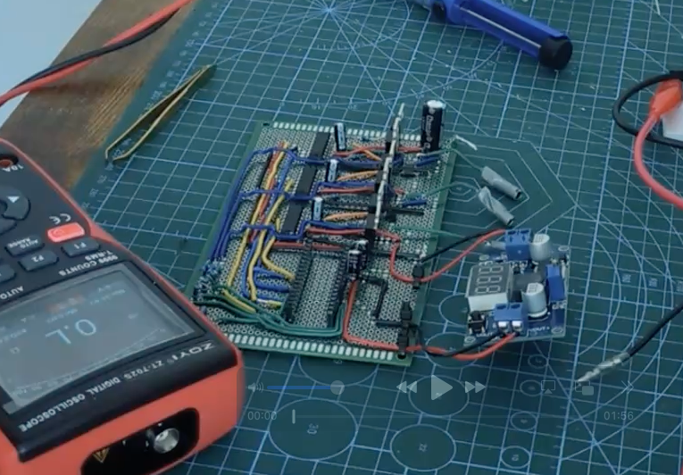

Here is the noise due to ripple for example (I had **multiple** 470uF caps on that rail !! plus 100nF at the pins !):

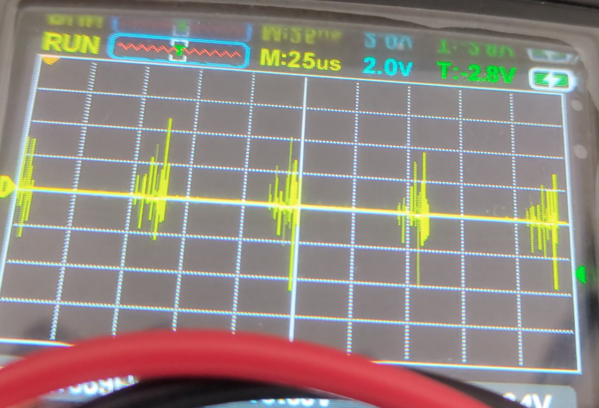

And the Back emf signal itself:

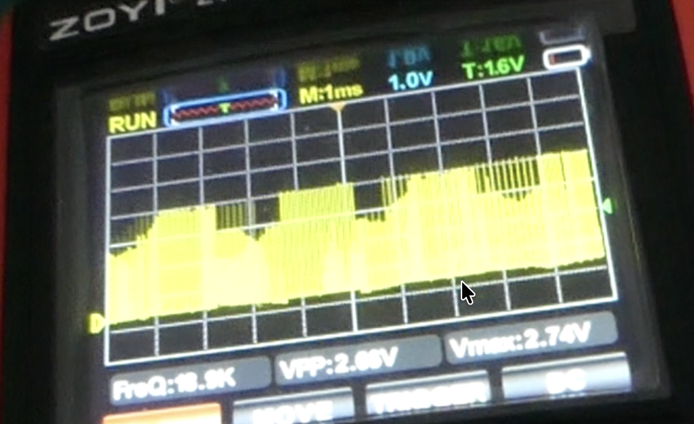

Frankly it does look like regular BEMF signals under PWM duty, but zoomed in, the ripple makes it very inconsistent, coupled with bad ground everywhere, I had to resort to blanking read tricks and software filters to get a somewhat ok reading of this.

I also tried to filter using an RC circuit:

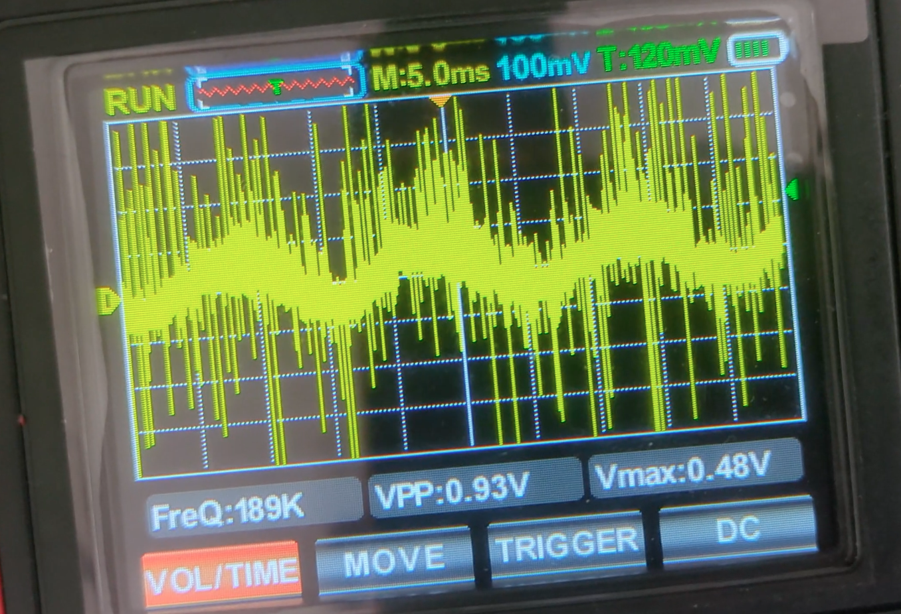

But yeah, no matter the RC value I used, the signals didn't make sense anymore and it was so noisy that it was basically unusable, probably due to the fact that precise RC filtering was not a good idea on such a noisy, compact and badly grounded perfboard prototype haha.

Anyway, back to the BEMF signals raw. To read them I used

- blanking period (to avoid reading right after PWM switching which induced lots of transient noise)
- basic moving average filters so that bad commutation (early detection due to noise) gets damped and the motor doesn't get hardstuck instantly.

Strangely enough, a simple **2 sample moving average filter** did the trick, and the motor was **able to spin closed loop** !!

here is a code snippet to see how simple the code was:

```c
// Closed loop logic : we sample ADC to check BEMF value against ZC THRESHOLD.
// A Blanking period is used to avoid sampling on rippled signal.
// Note the Arduino is too slow for that.
// The motor struggles to go fast / push the throttle.

bemf_t_0 = ADCH;

if (do_comm_once == 0 && blank_count >= BLANK_TICKS){
switch(step){
    case 0: case 1: case 2:
    if(bemf_t_0 < THRESHOLD_ZC){   // We crossed 0, we reset timer 1,
        TIMSK1 |= (1 << OCIE1A);     // re-enable, fires once after 30°
        raw_period = TCNT1;         // Get new last Period from last switch
        last_period = (raw_period + last_period) >> 1;
        zc_count++;
        do_comm_once = 1;
        OCR1A  = last_period >> 1;   // set delay = 30e° from the last period / 2
        TCNT1 = 0;
    }
    break;

    case 3: case 4: case 5:
    if(bemf_t_0 > THRESHOLD_ZC){
        TIMSK1 |= (1 << OCIE1A);
        raw_period = TCNT1;         // Get new last Period from last switch
        last_period = (raw_period + last_period) >> 1;
        zc_count++;
        do_comm_once = 1;
        OCR1A  = last_period >> 1;
        TCNT1 = 0;
    }
    break;
}
}
```

But the thing was the motor was super limited by that logic.

Because: the more samples we used for the moving average, the narrower the MA "low pass" property gets.

i.e. the acceleration was way worse and the motor may not adapt as well to speed oscillations due to torque ripple or sudden load variations, which caused instability on an unloaded BLDC motor which has no mass and thus has high frequency speed variations.

So it was a big tradeoff between **eliminating** misinterpreted zero crosses "**noise**" and **phase margin of the system**, thus the 2 sample moving average being a "good enough" compromise; allowing me to get a couple of good closed loop runs on that messy prototype.

To be honest, adding a load may have added a real physical low pass to damp all physical effect (torque ripple, load variations, etc...), allowing for less strict phase margin requirement overall... Which would have made testing part 10x easier.

**But** I had no propeller (or any safe 20k RPM spinning mass to screw onto it) on hand and did not wanna wait 2 weeks for some dude accross to globe to send it. So might as well stay in "*hard mode*".

Apart from that filtering hack, **the blanking period** : these were the real bad guys.

My Mosfet were **NOT** fast, they had a **HUGE** gate charge and bad properties that made them not suited for 20kHz PWM.

The transient (linear) phase, **that I needed to wait out** because it was too noisy, induced big dead times and **big blanking periods**; during which the CPU **ignore all measurements**. In the end, the real BEMF useful signal could only be read at a certain **max frequency** limited by that blanking period time (which is here to avoid noisy reading, remember !) and the CPU speed.

Ultimately, this led to a slow motor max speed. My estimations were around the low 7 to 10 000 RPM which is okay if the propeller is huge for a final application, but let's be honest, it was just too bad to be relied on at any point. I also ended ditching the Atmega and switch MCUs, but more on that in the next chapter.

### PCB design

Okay so at this point, I had to move to a PCB design.

This would get rid of most of my noise problem if I managed to route it right.

As well as the "transient" issues caused by the shitty automotive application mosfets.

On paper, this would allow me to really develop better performances as these were my 2 real and only big limiting issues.

But still, I decided to drop arduino and custom firmware support. At this point, I felt like I learned enough about these things that I felt comfortable using an external firmware (AM32) paired with a faster MCU.

Most of the reason being that, if a problem occurred on the PCB, the last thing I wanted was to spend weeks debugging to know whether the problem came from my own firmware or the hardware.

Anyways, I finally got the PCB done after considering all the issues above and making that final software side decision:

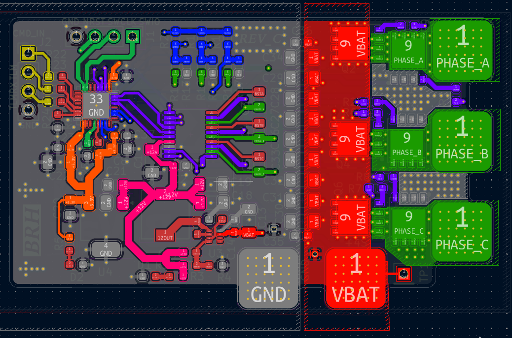

The design is somewhat the same as on a perfboard, except routing was **a bit more thoughtful** (to lower noise and actually handle current) and the brain is now an STM32F051 to run **AM32**.

I also used way better FETs that were actually cheap +  made for these types of applications.

You can see all the files and PCB details on the github : [Link](https://github.com/0BAB1/HOLY_ESC).

I then got them from PCBWAY which sponsored the youtube project:

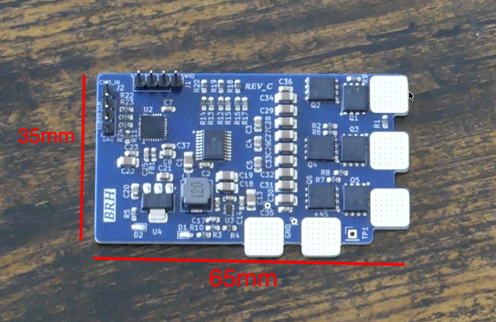

The PCB is 4 layers.

Total cost was 172USD. First runs were closer to 350USD but these used super expensive FETs.

I could get the costs down more:

- 22uF ceramic caps are 30cents + each, which gets expensive fast (could have used 25V-35V rated one which are 2-3x cheaper)
- BEMF divider was 0.1% tolerance due to me being paranoïd about that, but it was in fact not that important and I could have used standard 1% ones
- There is a back side silkscreen which is completely optional (but was better for the video)
- The specific STM32 MCU I use just gets bought all the time, could have used a cheaper one, this one goes for 5USD a unit on LCSC, which is kinda expensive IMO when you can get similar MCU for 2-3USD max or even 1.5USD and less in bulk orders.
- There is through hole components, and because I ordered the PCBA (fully assembled) this adds manual soldering which is not very smart when I could easily have done this myself.

But I decided to go for it anyways as the build was now within the sponsorship budget and the additional designing hours were not worth the save for such a small batch IMO.

## Theoretical max current

Regarding the theoretical max current, The main limiting factors are the FETs internal resistance and my traces.

let's first check the FETs internal resistance.

These are HY904C2 mosfets which I get for 0.26USD a piece a units worst case on LCSC:

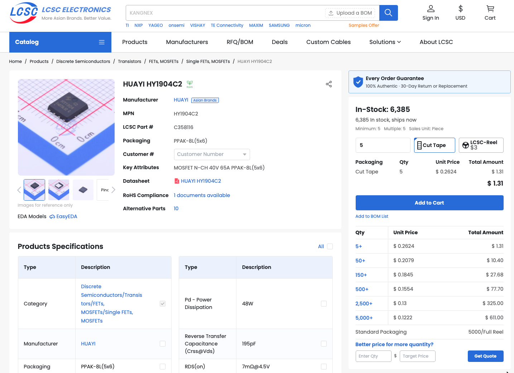

> Which is a pretty good deal ngl !

The fets have extremely low $R_{dson}$ and I drive them slightly above their rated typical $V_{gs}$ (@12V staying within 20V max limit), making them super conductive, but let's assume a 10V $V_{gs}$:

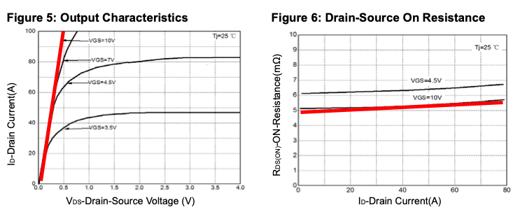

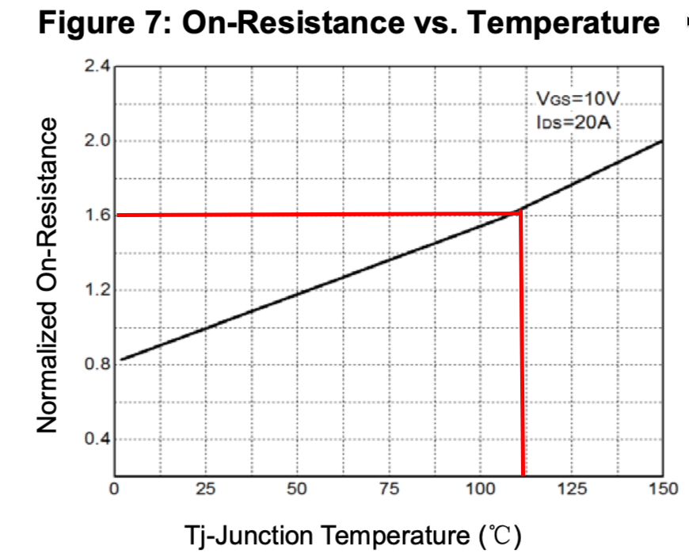

Let's say the FET reaches (worst case) 110°C, we get $R_{dsOnMax} = 5m\Omega \times 1.6 = 8m\Omega$ Let's say $10m\Omega$ to be conservative.

The copper pour is proportionally OK (gave it the most I could) but the board size is the limiting factor to dissipate all the heat.

So let's determine a board Thermal Resistance in $°C/W$.

First, the worst copper pour for a FET is going to be this one:

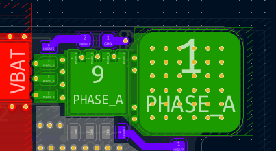

This top right mosfet has the smallest copper pour under its main thermal relief pad (and hence, the one limiting the design).

Using kicad, I estimate a 180mm^2 copper pour including the exposed pad. It has 2 layer connected by enough vias to easily spread the current across layers. And even though there are no vias placed under the pad, we can say current is going to be spread evenly to the second inner 180mm^2 copper pour on the inside of the board.

Also, because the copper pour is rather short, we'll assume an isothermal setup.

We'll lay down the total thermal resistance:

$$R_{thJA} = R_{thJC} + R_{via} + R_{spread} + R_{convection}$$

**$R_{thJC}$** is the drain pad to copper term. it can be ignored here as thermal conduction is basically super high and negligible.

**$$R_{via}$$** is the vias term, in parallel , there are also pretty negligible. Per via it is given at $192.414°C/W$ according to the [RFTools.io calculator](https://rftools.io/calculators/pcb/via-thermal-resistance/). I have 50 in **parallel** on this pour. To be conservative as not every one of them are as close to the heat source (even though I said it was isothermal but who cares), let's cut it to 30. This gives us **$6.4138 °C/W$**

**$R_{spread}$** is ignored as we said the pour is isothermal at this size.

**$R_{convection}$** is the actual number that scares me, as this is the actual resistance that takes into account the transfer of energy from the copper to the air.

Here are my estimates for this taking my copper pour size:

> these are rough as I do this in my free time and don't wanna do the calculations lol

- In still air : $85 °C/W$
- With propwash : $25 °C/W$

Which means , with an initial temperature of 25°C and T_max determined earlier to be 110°C, we have in still air:

$$P_{lossMax} \times R_{thJA} = (T_{max}-T_{Ambient})$$

$$P_{lossMax} = (T_{max}-T_{Ambient}) \div R_{thJA} = 85 / 85 = 1W$$

With an estimated dropped voltage when conducting of $U_{FetDropTypical} = 0.3V$:

$$P_{lossMax} = U_{FetDropTypical} \times I_{max} \implies I_{max} = 1W / 0.3V = 3.33Amps$$

Which kinda sucks ass to be honest. But given a FET only conducts 1/3 of the time but still loses more during transient, we can eyeball a safe coefficient of 1.5x of allowable current (again, don't wanna run absolutely all the number, we'll just stay conservative and it will be fine). Which gives use a theoretical max in still air of $5A$.

Applying the same method for propwash scenario (i.e. wind is blowing on the PCB, drastically improving its thermal resistance by 2-3x fold), we get... $17A$.

okay this still kinda sucks ass. BUT to be honest this is a conservative shot at estimating such a number. Ideally we would want to run IRL tests but I don't have the time so screw it, we'll tell the firmware to not got to hard on the board for too long and everything should be just fine :)

> Side note, the 1.5x factor and the voltage drop are really conservative estimates, rerunning the numbers using P = I^2 x Ron we get way better results but let's stay conservative !

## Personal thoughts on the project

Okay so overall the project was really great. I learned a gazillion things that will be super useful for later and that I'm already using at my job, making me more engaged with my day to day job operation, which is super cool.

It was a bit longer than I expected though but learning stuff takes time.

The thing that kinda got me down is the video, I really enjoyed editing it, made something I'm pretty proud of, got the sponsor etc... but turns out ESCs aren't really exciting content nowadays. Even though I make youtube videos for fun, the results can (most of the time) largely underperform expectations which kinda sucks. But that's life !

*Godspeed*

-BRH